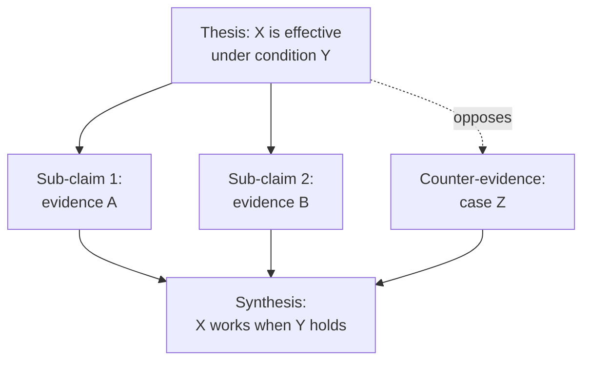
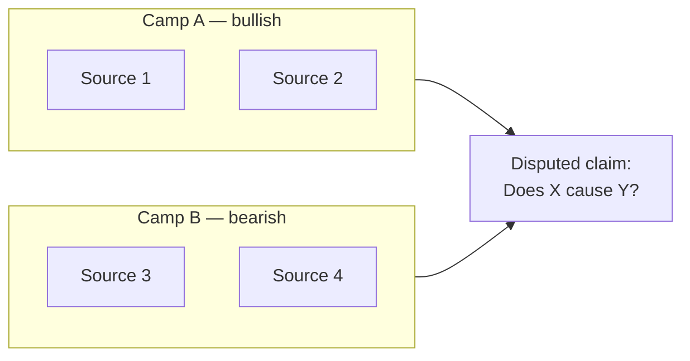

# Step 17 — Author diagrams into the final report

**Tier gate:** Runs for ALL tiers (light and full). The HTML render in step 18 turns Mermaid code blocks into SVG; if there are no Mermaid blocks, the HTML page has no visualisations. Step 17 is what makes the final HTML page worth reading on its own.

**Goal:** read the polished final report and inject Mermaid diagram blocks at sections where a diagram explains the point faster than the prose. The user is expected to read the HTML page (step 18 output) as the primary artifact, so diagrams must carry the load-bearing argument visually.

**Invariant:** prose is preserved. You insert Mermaid `mermaid` fenced code blocks ADJACENT to existing prose, you do not rewrite the prose around them. Use Edit hunks, not Write. The final report stays a markdown file — Mermaid blocks render as code in markdown viewers and as SVG in the step-18 HTML.

---

## Recover state

Read these inputs:
- `research/scaffold.md` — `vault_tag`, modality, `pipeline_tier`, response_format
- `research/prompt-decomposition.json` — atomic items + `required_section_headings`
- `research/notes/final_report_<vault_tag>.md` — the polished final report (output of step 16)
- `research/loci.json` if it exists (full tier) — the dialectical/structural loci that drove depth investigation
- `research/temp/source-tensions.json` if it exists (full tier) — expert disagreements
- `research/temp/contradiction-graph.json` if it exists (full tier) — opposing-claim clusters
- `research/comparisons.md` if it exists (full tier) — committed positions across loci

These give you the conceptual structure under the prose. You'll convert that structure into diagrams.

---

## Step 17.1 — Identify diagram opportunities

Read the final report end to end. For each H2 section, decide whether a Mermaid diagram adds load-bearing visual signal. Use the following catalog as your menu — pick the types that match the modality and content:

| Diagram type | Mermaid syntax | Best for |
|---|---|---|
| Hypothesis tree | `graph TD` | argumentative modality — root thesis branching into sub-claims, with evidence weight on edges |
| Contradiction graph | `graph LR` | when the report engages a tension — opposing claims with the resolving synthesis as a third node |
| Source-tension matrix | `graph TD` or `flowchart TB` with subgraphs | when expert camps disagree — group sources by camp, show the disputed claim in the middle |
| Architecture / system diagram | `graph LR` or `flowchart LR` | when the report describes a system, pipeline, or stack — boxes for components, arrows for data flow |
| Sequence / timeline | `sequenceDiagram` or `gantt` | when temporal ordering matters — historical evolution, request flow, milestones |
| Comparison matrix | `quadrantChart` or markdown table → diagram | when the report compares 3+ entities across 2+ dimensions |
| Decision tree | `graph TD` | when the report ends in a recommendation with branching conditions |
| State machine | `stateDiagram-v2` | when the report describes lifecycle / phase transitions |
| Mind map | `mindmap` | for the executive summary — radial structure showing the report's argumentative scaffolding |
| Pie / bar | `pie` / `xychart-beta` | only when the report quotes hard quantitative claims worth visualising |

**Required minima per tier:**
- `light` tier: at least **2** diagrams. One MUST be a mindmap or hypothesis-tree opening the executive summary (gives the reader the whole argument at a glance).
- `full` tier: at least **4** diagrams. At least one MUST visualise a contradiction or source tension from `loci.json` / `source-tensions.json`. At least one MUST be a hypothesis tree or argument map for the thesis. The remaining slots cover system architecture, comparison, timeline, or decision tree as the content warrants.

**Cap:** 8 diagrams per report. More than 8 makes the HTML page noise.

---

## Step 17.2 — Author each diagram

For each diagram, write a Mermaid block that:

1. **Loads the load-bearing content from the report**, not generic placeholders. A hypothesis tree must show the report's actual thesis and its actual sub-claims, named with the report's exact terms. A source-tension diagram must name the actual expert camps the report engaged.

2. **Stays small** — 7-15 nodes typical, 25 max. A diagram with 50 nodes is unreadable. If the section has more structure than that, pick the top level and link out to a sub-diagram below the section, or split into 2 diagrams.

3. **Uses clear labels** — node labels are 1-4 words, edge labels (where present) name the relationship (`supports`, `contradicts`, `derived from`, `flows to`, `triggers`).

4. **Stays Mermaid-clean** — no LaTeX, no HTML tags inside labels, no unescaped parentheses, no `&`. Quote labels with spaces: `A["Node label"]`. Keep node IDs short ASCII identifiers.

5. **Self-contained** — a reader who just looks at the diagram should understand the point. Don't rely on prose to explain what the diagram means.

**Worked example (hypothesis tree for an argumentative report on, e.g., "is X effective"):**

````

````

**Worked example (source-tension diagram):**

````

````

---

## Step 17.3 — Insert diagrams via Edit

For each diagram you decided to author:

1. Pick the insertion anchor — the most natural place is **immediately after the H2 heading** of the section the diagram visualises, or **immediately before the section's closing summary paragraph** if the diagram works better as a summary.

2. Use the Edit tool on `research/notes/final_report_<vault_tag>.md` with:
   - `old_string` = a unique anchor line from the existing report (an H2 heading line, or the first sentence of the closing paragraph) — copy it exactly from the Read output
   - `new_string` = the same anchor line, followed by a blank line, the Mermaid fenced block, a blank line. (Or, for "before closing paragraph" insertions, the Mermaid block followed by a blank line followed by the anchor line.)

3. **Do not edit prose.** The only change in each Edit hunk is the inserted Mermaid block + surrounding blank lines.

4. If a chosen anchor isn't unique in the file, expand `old_string` to include the line before or after until it's unique.

**Order of insertion:**
1. Executive-summary mindmap or hypothesis tree FIRST (the reader sees the whole argument up front).
2. Body-section diagrams in document order.
3. Decision-tree / recommendation diagram LAST (the closing actionable view).

---

## Step 17.4 — Log decisions

Write `research/diagram-log.json` with:

```json
{
  "vault_tag": "<vault_tag>",
  "tier": "<light|full>",
  "diagrams_authored": [
    {
      "id": "diag-1",
      "type": "mindmap | hypothesis-tree | source-tension | architecture | sequence | comparison | decision-tree | state-machine | pie | bar",
      "anchor_h2": "<exact H2 text the diagram was inserted under>",
      "node_count": <int>,
      "rationale": "<one sentence on what argumentative load this diagram carries>"
    }
  ],
  "diagrams_skipped": [
    {"section": "<H2 text>", "reason": "<why this section did not get a diagram>"}
  ]
}
```

This is the audit trail. The step-18 HTML render reads the final_report file (which now contains the Mermaid blocks); it does not re-read this log. The log is for future review only.

---

## Exit criterion

- The final report file contains at least the per-tier minimum number of Mermaid fenced blocks (2 for light, 4 for full).
- Every Mermaid block parses (no unclosed brackets, no unescaped special chars). Quick mental sanity check: every `[` has a matching `]`, every `(` has a matching `)`, every subgraph has its matching `end`.
- The prose around each Mermaid block reads naturally — the diagrams ADD to the section, they don't break a flowing paragraph in half.
- `research/diagram-log.json` exists and lists every diagram you authored.
- The report's H2 structure and prose are otherwise unchanged from step 16's output.

---

## Then

Return to the entry skill (`hyperresearch`). Mark step 17 todo complete. Invoke step 18:

```
Skill(skill: "hyperresearch-18-render-html")
```
