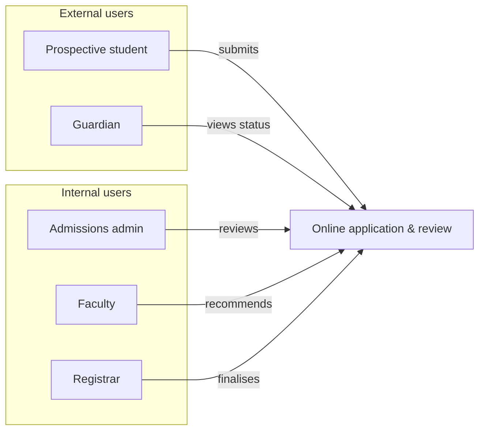
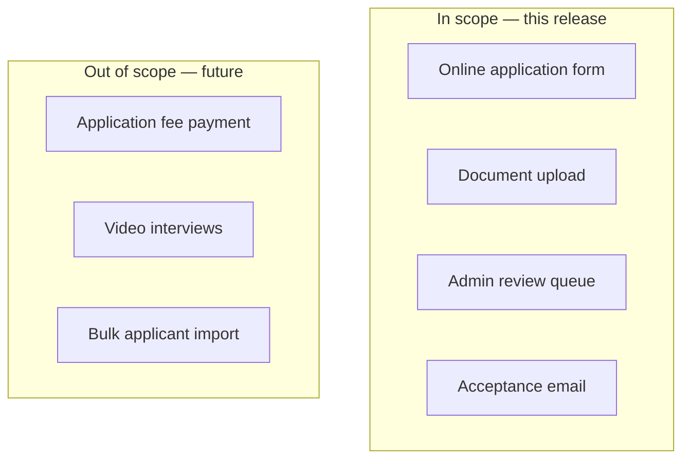
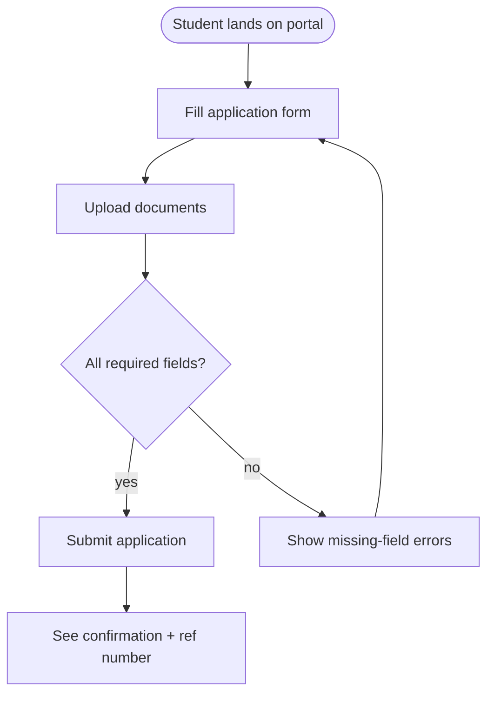

# Step 29 — Author diagrams into the final PRD

**Tier gate:** Runs for ALL tiers (light and full).

**Goal:** read the polished final PRD and inject Mermaid diagram blocks at sections where a diagram conveys the PRD's structure faster than prose. The reader is expected to open the HTML page (step 30 output) as the primary artifact; diagrams must carry the load-bearing business structure visually.

**Invariant:** prose is preserved. You insert Mermaid `mermaid` fenced code blocks ADJACENT to existing prose using Edit hunks. Never rewrite the surrounding text. The PRD must remain business-only — no schemas, no APIs, no architecture vocabulary leaks into your diagram labels either.

**Vocabulary firewall:** every diagram is in **product / user / business** vocabulary. Do not draw:
- ❌ ER diagrams / database schemas
- ❌ REST endpoint maps / API surface diagrams
- ❌ Microservice / class / module diagrams
- ❌ Threading / async / queue topologies

Draw instead:
- ✅ Persona maps (who uses what)
- ✅ User flows (what the user does, step by step, in user-visible UI states)
- ✅ Feature scope diagrams (what's in / out of scope)
- ✅ Integration touchpoints (which existing surfaces the new feature lives in)
- ✅ Entity relationships at the **business-concept** level (e.g. "a Student has Courses"), not the DB schema level
- ✅ Journey maps and state machines for the user-visible lifecycle of an entity (e.g. "Application: Submitted → Under Review → Accepted")

---

## Recover state

Read these inputs:
- `prd/scaffold.md` — `prd_tag`, `pipeline_tier`, `prd_format`
- `prd/prd-decomposition.json` — required headings + atomic items
- `prd/feature-decomposition.json` — in_scope / out_of_scope, capabilities, personas, entities
- `prd/personas-and-stories.json` if it exists — persona list + user stories
- `prd/flows-and-entities.json` if it exists (full tier) — user flows + entity fields
- `prd/integration-map.json` if it exists — integration touchpoints
- `prd/notes/final_prd_<prd_tag>.md` — the polished final PRD (output of step 28)

These give you the structured content under the prose; you convert structure into diagrams.

---

## Step 29.1 — Identify diagram opportunities

Read the PRD end to end. For each H2 section, decide whether a Mermaid diagram adds load-bearing visual signal. Use this PRD-specific catalog:

| Diagram type | Mermaid syntax | Best for |
|---|---|---|
| Feature overview mindmap | `mindmap` | one-glance summary at the top — feature name as root, branches = top capabilities |
| Persona map | `graph LR` with subgraphs | "who uses this" — group personas by role, link each to the capabilities they touch |
| User flow | `flowchart TD` or `sequenceDiagram` | step-by-step what the user does, with branching on conditions |
| Journey map | `journey` | the user's emotional / experiential arc across the feature |
| Entity lifecycle | `stateDiagram-v2` | a key business entity's user-visible state transitions (e.g. Application: Draft → Submitted → Reviewed → Accepted) |
| Business entity relationship | `graph LR` | conceptual relationships ("a Student has many Courses") — NOT a DB schema |
| Scope boundary | `graph TD` with two subgraphs | in_scope vs out_of_scope — explicit boundary the dev team can see at a glance |
| Integration touchpoint map | `graph LR` | which existing product surfaces the new feature shows up on |
| Decision tree | `graph TD` | "if user does X, then Y" branching rules the PRD specifies |
| Capability matrix | `quadrantChart` or table | when comparing capabilities across personas or modes |

**Required minima per tier:**
- `light` tier: at least **3** diagrams. One MUST be the feature-overview mindmap at the top of the PRD. One MUST be a persona map or a user flow showing the primary user's path.
- `full` tier: at least **5** diagrams. Required types: feature-overview mindmap (top), persona map, primary user flow, in/out-of-scope boundary, integration touchpoint map. Additional diagrams (journey, entity lifecycle, decision tree) as the PRD content warrants.

**Cap:** 10 diagrams per PRD. More than 10 means the HTML page is busier than it is useful.

---

## Step 29.2 — Author each diagram

For each diagram, write a Mermaid block that:

1. **Loads the actual PRD content** — persona names, capability names, entity names as the PRD itself uses them. A persona map that says "User A / User B" instead of the actual persona names is useless.

2. **Stays business-vocabulary** — re-read your diagram before inserting. If you see "endpoint", "table", "service", "queue", "schema", "DTO", "API", "model" — rewrite it. If a node label feels like engineering jargon, replace it with the user-visible thing it represents.

3. **Stays small** — 7-15 nodes typical, 25 max.

4. **Uses clear labels** — node labels are 1-4 words, edge labels (where present) name the user-visible relationship (`submits`, `reviews`, `notifies`, `triggers`, `appears on`).

5. **Stays Mermaid-clean** — quote labels with spaces, escape special characters, no LaTeX, no HTML inside labels.

**Worked example (persona map for a higher-ed ERP feature):**

````

````

**Worked example (in/out-of-scope boundary):**

````

````

**Worked example (user flow for primary persona):**

````

````

---

## Step 29.3 — Insert diagrams via Edit

For each diagram you decided to author:

1. Pick the insertion anchor — the most natural place is **immediately after the H2 heading** of the matching section, or **at the top of the PRD** for the feature-overview mindmap (insert immediately after the H1 title or the first paragraph).

2. Use the Edit tool on `prd/notes/final_prd_<prd_tag>.md` with:
   - `old_string` = a unique anchor line (H2 heading, or first sentence of a section's closing paragraph) — copy exactly from the Read output
   - `new_string` = the anchor line, blank line, the Mermaid fenced block, blank line. (Or for "before closing paragraph" insertions, the inverse.)

3. **Do not edit prose.** Only the Mermaid block + blank lines are added.

4. If a chosen anchor isn't unique, expand `old_string` until it is.

**Order of insertion:**
1. Feature-overview mindmap FIRST (top of PRD — readers see the whole feature at a glance).
2. Personas map second (right after the personas section opens).
3. Primary user flow / journey third.
4. Scope-boundary diagram in the scope section.
5. Integration touchpoint map in the integration section.
6. Remaining diagrams in PRD-section order.

---

## Step 29.4 — Verify vocabulary firewall

Before logging, scan every Mermaid block you authored for forbidden vocabulary. Grep your own additions for these tokens and treat any hit as a defect to fix:

```
endpoint, REST, API, GET, POST, PUT, DELETE,
schema, table, column, foreign key, index,
service, microservice, queue, kafka, redis,
DTO, ORM, repository, controller,
thread, async, await, mutex
```

If any token appears, rewrite the offending node label in user/business vocabulary, then re-Edit the file.

---

## Step 29.5 — Log decisions

Write `prd/diagram-log.json`:

```json
{
  "prd_tag": "<prd_tag>",
  "tier": "<light|full>",
  "diagrams_authored": [
    {
      "id": "diag-1",
      "type": "feature-overview-mindmap | persona-map | user-flow | journey | entity-lifecycle | scope-boundary | integration-map | decision-tree | capability-matrix",
      "anchor_h2": "<exact H2 text the diagram was inserted under, or 'TOP' for feature-overview>",
      "node_count": <int>,
      "rationale": "<one sentence on what business / user-visible structure this diagram carries>"
    }
  ],
  "diagrams_skipped": [
    {"section": "<H2 text>", "reason": "<why this section did not get a diagram>"}
  ],
  "vocabulary_firewall_passes": true
}
```

---

## Exit criterion

- The PRD file contains at least the per-tier minimum number of Mermaid fenced blocks (3 for light, 5 for full).
- Required diagram types for the tier are present (see Step 29.1 minima).
- No Mermaid block contains forbidden engineering vocabulary.
- Every Mermaid block parses (balanced brackets, matching `end` for subgraphs).
- `prd/diagram-log.json` exists with `vocabulary_firewall_passes: true`.
- The PRD's H2 structure and prose are otherwise unchanged from step 28's output.

---

## Then

Return to the entry skill (`hyperresearch-prd`). Mark step 29 todo complete. Invoke step 30:

```
Skill(skill: "hyperresearch-prd-30-render-html")
```
